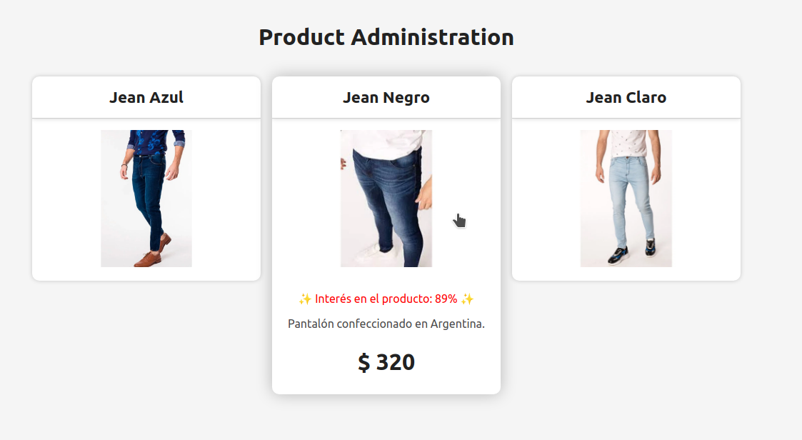

# Summa Solutions challenge: Product impressions

Tenemos que crear una aplicación que muestre el interés percibido en los productos 1, 2 y 3. Lamentablemente nuestro backend no tiene implementado un método para obtenerlos todos al mismo tiempo así que hay que traerlos de a uno, en paralelo.

## API

- GET https://localhost:8000/status/:id -> Obtiene las impresiones que tiene un producto

> El código de la API no debe ser modificado.

## Frontend

- Debe mostrar las impresiones de los tres productos.
- La cantidad se debe actualizar cada 5 segundos.
- Al hacer click en la tarjeta de prouctos se debe ocultar/mostrar detalles (dejo de traerme información).

> TODO el código de la aplicación frontend puede ser modificado.
> Los assets se encuentran en la carpeta `assets` dentro del proyecto del cliente.



## Corriendo el proyecto

```bash
# Instalar dependencias del proyecto
npm install

# Instalar dependencias de los paquetes
npm run bootstrap

# Correr backend y frontend de desarrollo
npm start
```

## Modalidad de presentación

- Deberá codearse durante la entrevista, pudiendo previamente tenerlo practicado.
